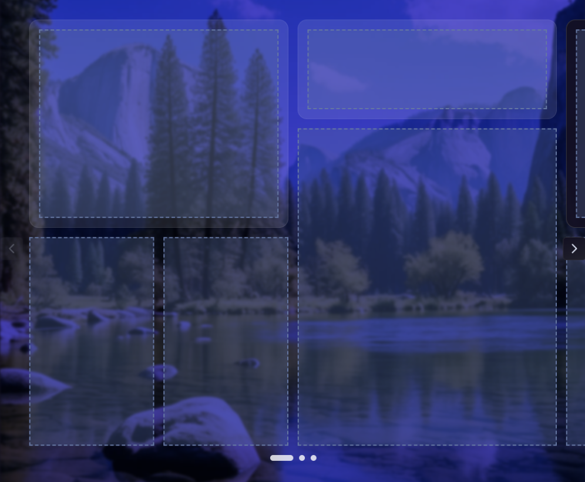

# @hakit/sliders

Slider components for HAKIT.

## HeroSlider

A slider component where each slide is an 8×8 grid. You can drop components into grid slots to build custom layouts.

### How it works

Each slide uses an 8×8 CSS grid. You add items to a slide, and each item can span anywhere from 1×1 to 8×8 grid units. Every item is a slot, so you can drag any HAKIT component into it - entity cards, custom components, etc. You just can't nest a HeroSlider within itself.

The slider handles centering the active slide and applies visual effects to inactive ones (scale, opacity, blur, translation - all configurable). You can swipe between slides, use the arrow buttons, or click the bullet indicators at the bottom.

### Configuration

- **Slide width**: Each slide can have its own width (80%, 100%, 30%, etc.)
- **Transitions**: Pick from a bunch of easing functions and set the duration
- **Visual effects**: Control how inactive slides look - scale them down, fade them, add blur, shift them horizontally
- **Navigation**: Toggle the arrow buttons and bullet indicators on/off
- **Position memory**: Option to remember which slide you were on after page refresh

### Tips

- Works best at the root level of your dashboard
- Let it span full width for the best look (happens automatically in full-width slots)
- Plan your layouts around the 8×8 grid - items can overlap if you're not careful
- The grid uses `grid-auto-flow: dense`, so it'll try to fill gaps automatically

## Development

See [DEVELOPMENT.md](./DEVELOPMENT.md) for setup and build instructions.
